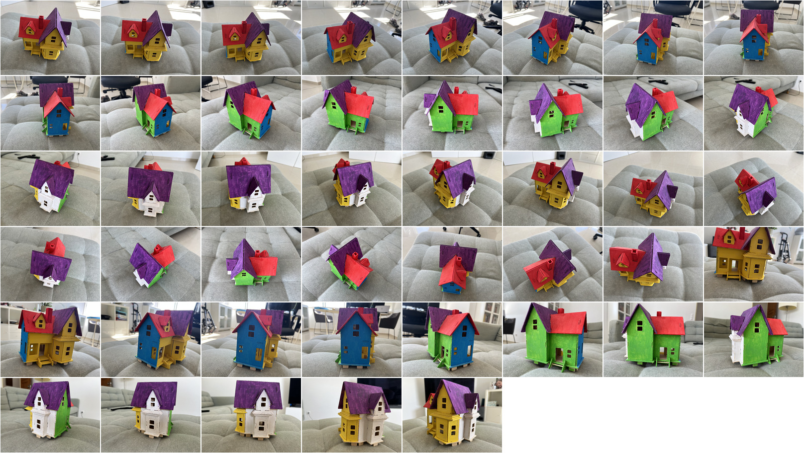
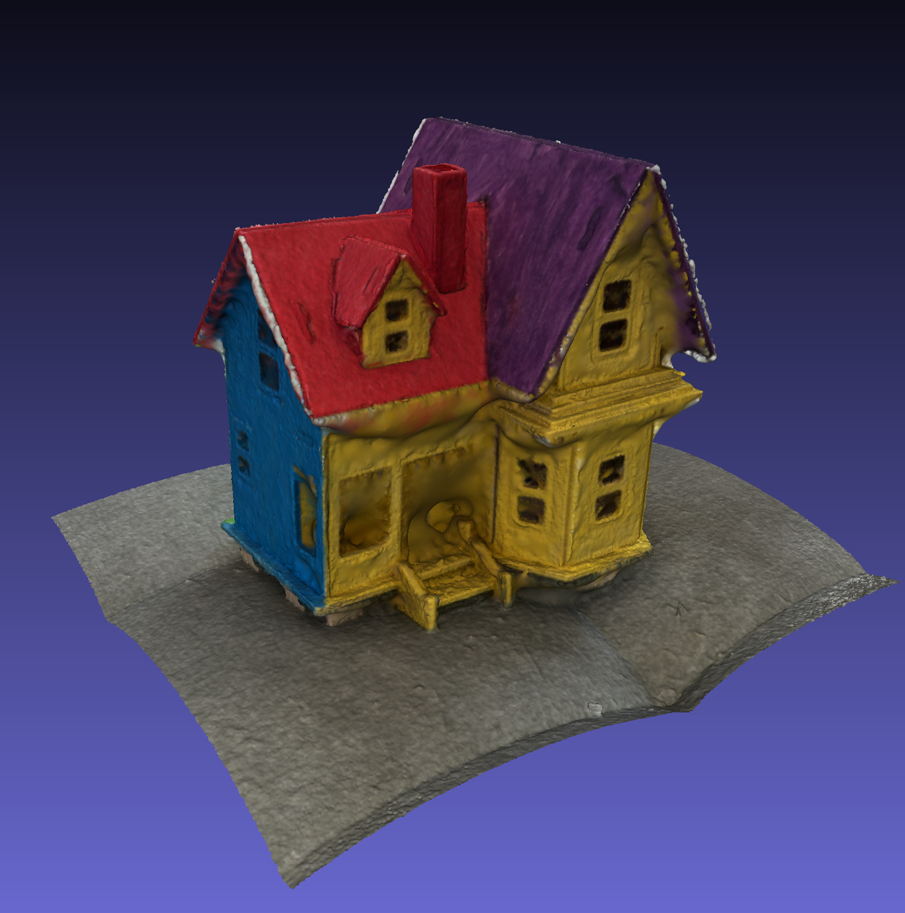
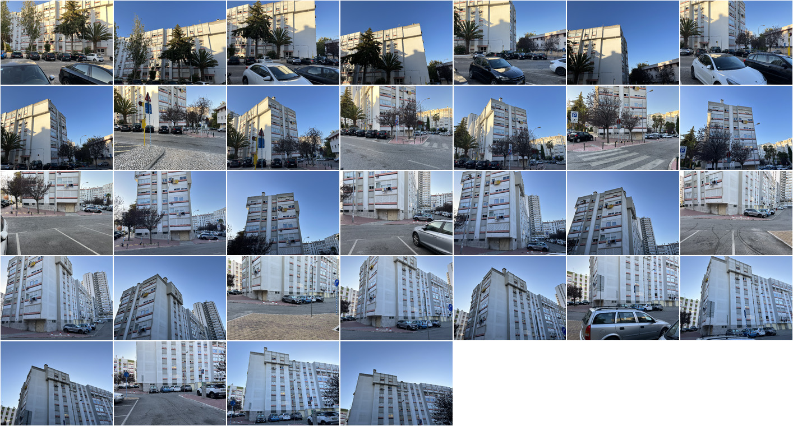
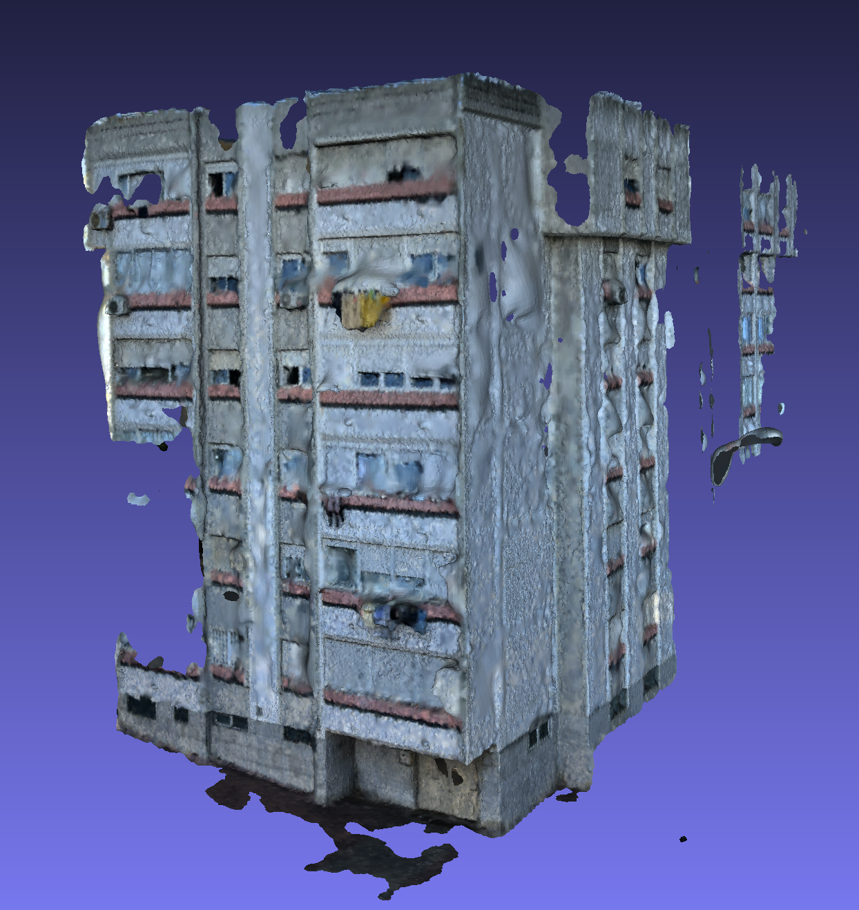
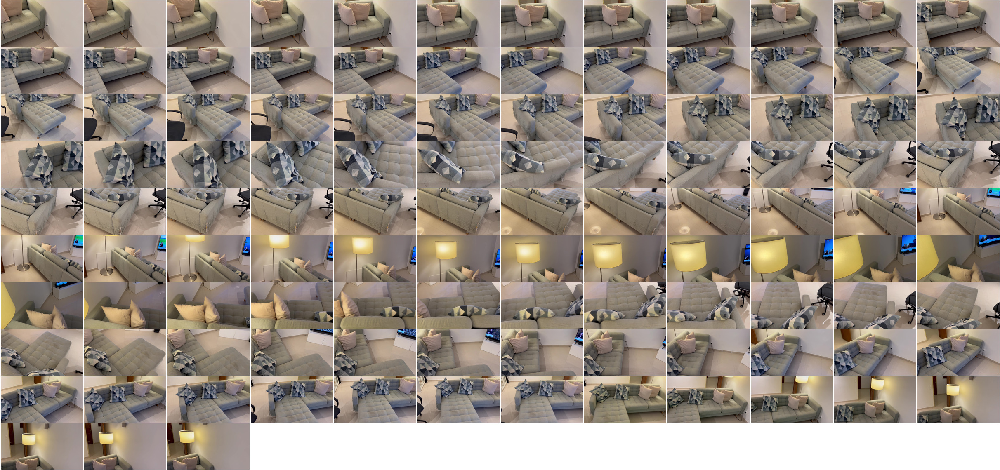
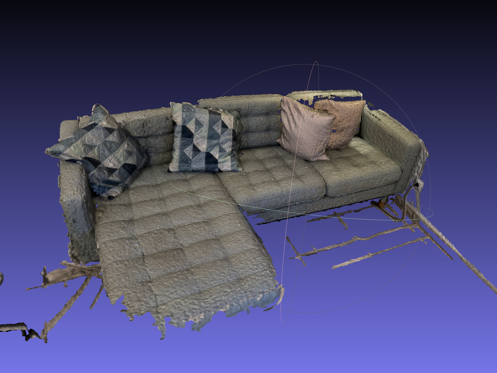

# Exploring Gaussian Splatting

I spent the whole saturday capturing and creating models of stuff using gaussian splatting (GS) and photogrammetry (PG). These are my findings.

First off, I used my iphone 13 pro to take photos and videos and used both the [windows branch by John Stevens](https://github.com/jonstephens85/gaussian-splatting-Windows) for generating the gaussian splats and [colmap](https://colmap.github.io/) alone to do photogrammetry counterparts the same content and compare. I say alone because colmap is used to do the early stages of GS too.

I kept my camera's exposure locked throughout the session. I never used zoom and tried to overlap 1/3 of the image on most shots.
One very useful thing I did early was edit train.py so it creates a couple of early results before the 30k final one: I did 2500, 10k and 30k. Then prepared a batch script to easily be able to open the viewer as soon as each intermediate result is ready, so one can immediately grasp whether the cam estimations are working and the ongoing work is worth waiting for. I noticed that in the occasions the training step started to slow down considerably, the algorithm was estimating loads of garbage. If so, abort early and either try again or improve your input capture material...

I started by assuming I could work my way by taking ~20 pictures with a couple of overlap and maximize the angles over the subject. That's how I captured the initial models.

## wooden house

<iframe src="https://player.vimeo.com/video/872320780?badge=0&amp;autopause=0&amp;quality_selector=1&amp;progress_bar=1&amp;player_id=0&amp;app_id=58479" width="1280" height="720" frameborder="0" allow="autoplay; fullscreen; picture-in-picture" title="wooden house - checking GS results"></iframe>

[wooden house GS]({SITE_HOST}/gaussian/#1)

The first subject was a small wooden house I have. This one worked great - I managed to control the setup, both the sofa below it and the house surface are rough which surely helped identifying singularity points better.
I then tried to use photogrammetry to see how well that would fare against GS. Used [meshlab](https://www.meshlab.net/) to rotate the model and remove irrelevant geometry. Very decent result - holes aren't fully carved and the surface is a bit bumpy but I haven't attempted decimation or other simplification steps. Also it was super fast - medium quality poisson mesher took 5 min. I suppose simple subjects work well on both!

I then went outside and captured 2 subjects.: a very large tree and 3 facades of the building I live on.

## a tree

<iframe src="https://player.vimeo.com/video/872320550?badge=0&amp;autopause=0&amp;quality_selector=1&amp;progress_bar=1&amp;player_id=0&amp;app_id=58479" width="1280" height="720" frameborder="0" allow="autoplay; fullscreen; picture-in-picture" title="tree - checking GS results"></iframe>

[tree GS]({SITE_HOST}/gaussian/#3)

The tree stands near a road and that made me keep some overlapping gaps as I haven't taken pictures in the middle of the road. Tried to do a 360 and then captured a few extra details.
The tree was a mess. I believe colmap couldn't figure out 2/3 of the poses I captured and either skipped them entirely or integrated them badly. I guess the former happened. The training time was stalling (30-40 min to 2h...) and once I used the viewer on early results I could see only half of the tree was 'seen' and many features were misiniterpreted. The photogrammetry results also only used the same subset of angles (clearly a capturing issue on my part) - not horrible results but got only a very partial surface sampled.

## building facades

<iframe src="https://player.vimeo.com/video/872321307?badge=0&amp;autopause=0&amp;quality_selector=1&amp;progress_bar=1&amp;player_id=0&amp;app_id=58479" width="1280" height="720" frameborder="0" allow="autoplay; fullscreen; picture-in-picture" title="building facade - checking GS results"></iframe>

[building facade GS]({SITE_HOST}/gaussian/#4)

For the building facades, I placed myself the furthest away and did vertical sweeps of 2 angle shots, moving in an arc to keep myself parallel to those facades.
The result wasn't as bad as the tree but there a couple of prevalent problems: there were many cars in the foreground adding noise, the palm trees near the entrance ruined the wall behind them and due to the fact I did overall an arc of < 180 degrees with lots of sky in frame, that resulted in many flying sky blobs around the scene.

## my living room couch

<iframe src="https://player.vimeo.com/video/872320478?badge=0&amp;autopause=0&amp;quality_selector=1&amp;progress_bar=1&amp;player_id=0&amp;app_id=58479" width="1280" height="720" frameborder="0" allow="autoplay; fullscreen; picture-in-picture" title="couch - checking GS results"></iframe>

[couch GS]({SITE_HOST}/gaussian/#5)

Since I was getting worse and worse results and felt most of the problem was too few poses and overlap, I decided to capture my living room couch in video. Used ffmpeg to extract 5 frames/sec out of it. This resulted in using 50 not-so-focused pictures which a lot of overlap. Interestingly enough, GS training doesn't suffer much from adding more pictures. The results were ok for the effort I put. The lighting wasn't great to begin with and I got many wall blobs floating around, as had happened with the building facade. Seems like starting from video is a better compromise as it enforces one to overlap more, which colmap seemed to have loved.

Now, some considerations about photogrammetry vs gaussian splatting. PG gives you far less of the model captured but doesn't often show incorrect data (you can have the surface with holes, but what's meshed is mostly correct). GS is completely different: it tries to paint blobs to match what was seen from every angle and when information lacks it often assumes things are closer than they actually are. This is the main source of those annoying floating solid blobs. I will attempt to capture with multiple passes over the scene to try to pin any solid surfaces near the vicinity of the captured scene. A thing I like to do is crop the scene to a meaningful box. That works well for super controlled and small scenes such as the wooden house or a shoe, but on outside scenes, keeps the technique from illustrating the overall environment, which is a great thing about GS.

We're still in the infancy of using these things. Most viewers offer a terrible navigating experience. Is super important to start from a recognizable point of view and having the scene properly aligned to begin with and be able to move around. I've been experimenting with some viewers so I can properly display the stuff I have and I'm not yet happy with the results.

As for capturing and preparing GS content, there's room for improvement. If I could integrate the depth data from the picture I take indoors, at least on those scenes I would be able to prevent having flying blobs. Having tools to select and move or delete faulty blobs would be great too.
