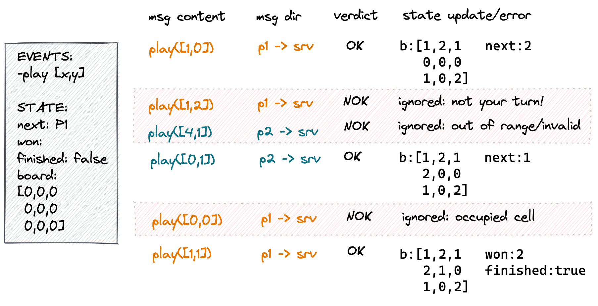

<!-- _paginate: false
_footer: ''
_class: clouds
_backgroundImage: url('./bg/main.jpg') -->

# multiplayer games

september 2022,
José Pedro Dias

---

<!-- _backgroundImage: url('./bg/dark-gradient.png')
_color: white -->

*A multiplayer game is one where the actions of each participant influence the state of the game for all.*

Multiplayer games can span a whole range of genres and they can be implemented with different underlying technologies and abstractions.

---

<!-- _class: clouds -->

# classify games
---

<!-- _class: red -->
# action cadence

- **turn based** (tic-tac-toe, worms, monopoly)
- **real-time** (age of empires, quake, table football)

Turn based games are easier to reason about and demand less of the server.

---

# game state values

- **discrete values** (checkers, chess, connect 4)
- **continuous values** (quake, mario kart)

These call for different approaches in terms of animation and AI.
Game may simultaneously feature data of both kinds.

---

# state visibility

- **completely open** (tic-tac-toe, snake)
- **partially hidden state**
    - RTS games: fog-of-war
    - card games: hidden hands from other players
    - FPS games: BSP + camera frustum determine what each player sees

---

<!-- _class: clouds -->

# updating state and tick rate
---

# game state update

Every game is expected to call a function which given the **current game state** and **new events** computes an **updated game state**.

On **turn based games** this function can be called **as each event arrives** and update state at the rate of arrival.
On **real-time games** a **constant period of time** is used. All events in that period serve as inputs to determine the next state.

---

<!-- _class: center -->

## rock paper scissors

---

<!-- _class: center -->

## tictactoe

---

## realtime examples

---

# tick rate

The tick rate determines **how frequently the update function runs**.
A game with a 20 fps tick rate means it groups incoming player events in slots of 1s/20 = 50ms. After each tick, an update function with this signature is run:

`(events, state) -> state'`

As the result of this, clients are told the new state (subject to optimizations).

The tick rate **depends on the nature of the game**. Some genres allow for fewer tick rates and heavy use of interpolation while others need more frequent updates to be computed.

---

<!-- _class: clouds -->

# Topologies
---

# multiplayer topologies

- **authoritative server** aka **client+server**
    all players/clients **submit their actions to the server**. game **state gets computed there** and distributed back to all players
- **relay** or **peer to peer**
    all players/clients have their own local views of the game state and **share their actions to others** so **others compute** them
- **authoritative with client-side prediction** aka **lockstep+rollback**
    players **submit their actions to the server** and also **run a local simulation**, used to optimistically render the player actions earlier (subject to corrections from server)

---

## authoritative and P2P topologies

 

---

## relay topology

---

# topologies pros and cons 1/2

In **relay/P2P** the **evolution** of game state is **driven by each individual client**. Initial game states can differ. Incoming actions from remaining players ought to be respected but **it's impossible to enforce rules and order**.
Can be a **viable** solution for **slow-paced games** where entities belonging to one player don't directly impact the remaining players (ex: ghost cars in racing games).
Server work is limited to broadcasting events (relay) or none if P2P is used.

---

# topologies pros and cons 2/2

In **authoritative** modes state and state evolution are **completely driven by a dedicated server**.
**Authoritative** is mandatory for any popular competitive game due to cheating.  
**Client-side prediction** is standard for AAA fast-paced games and its as more challenging as more player-driven entities interact between players (ex: Rocket League simpler than Counter Strike)

---

<!-- _class: center -->

## lockstep + rollback

---

<!-- _class: clouds -->

# Other features

---

# lobbies and match making

People don't join games at the exact same time. They may not even know each other.
The **lobby** is a stage in the game where multiple players can **gather before the game starts**. It typically allows text **communication** and supplies a way for players to **invite other players** to take part in a shared game.
With **match making** the game takes care of **pairing up players into actual games automatically** according to a set of criteria.
They both solve the same problem but the latter relies on game services to do the heavy lifting.

---
# scripting capabilities

**Game servers** tend to **run in combination** with well established **game engines** such as Unity, Unreal, Godot, Cocos2d, Gamemaker, Pixi, etc.
Most of these support several programming languages.

**External programming language support** therefore became a popular feature for game servers frameworks, so developers can **use the same language on both sides of the game logic**, client and server.

A game server can do this by exposing a **clear API**, prepare logic modules, manage the language runtime and drive its code alongside its core.
Ex: Nakama supports Go, JS and Lua.

---

# available network transports

- **non-web**
    - **TCP** (reliable and ordered stream)
    - **UDP** (unreliable discrete packets)

- **web**
    - **HTTP** (request/response)
    - **Server Side Events** (server driven messages)
    - **Web Sockets** (bi-directional messages)
    - **WebRTC** (for P2P and supporting audio/video streaming)
    - **WebTransport** (new standard, will unlock UDP-like comms)

---

<!-- _class: clouds -->

# Challenges
---

# challenges 1/3

- **avoid disparate state** (skipping events, non-deterministic events processing order, different RNGs, rounding errors, incorrect logic in code)

- **minimize lag** (locally process ticks ahead, choose different topology, have animations easing change)

- **respect the tick rate** (hard with many incoming events and/or complex simulations)

---

# challenges 2/3

- **cheating prevention efforts**
    - make sure not to send clients state they're not supposed to see
    - rate limit incoming events
    - ignore events with out-of-range values
    - ignore events with impossible sequences of events
    - defend against invalid messages breaking the server

- **provide matchmaking support** - expected to exist nowadays, very useful to help the game popularity network effect

---

# challenges 3/3

- **support dynamic game server allocation**, so servers scale at peak popularity and we don't go broke

- **minimize server-side corrections*** - shares same problems as **avoid disparate state**

- **support many players in the same game** (MMOs, requires additional architectural changes, out of scope)...

\* for games with client-side prediction

---

<!-- _class: clouds -->

# Existing Solutions
---

# commercial game servers

- Unity Multiplay: [1](https://unity.com/products/multiplay)
- Epic Online Services: [1](https://dev.epicgames.com/en-US/services-games)
- Microsoft Playfab: [1](https://playfab.com/) [2](https://docs.microsoft.com/en-gb/gaming/playfab/features/multiplayer/)
- AWS Gamesparks: [1](https://www.gamesparks.com/) [2](https://docs.gamesparks.com/documentation/gamesparks-real-time/)
- Photon: [1](https://www.photonengine.com/en-US/Quantum)
- Improbable: [1](https://www.improbable.io/careers/game-technology)

---

# OSS game servers

- nakama [1](https://heroiclabs.com/docs/nakama/getting-started/index.html)
- colyseus [1](https://www.colyseus.io)
- lance [1](https://lance-gg.github.io) [2](https://github.com/lance-gg/lance) [3](https://lance-gg.github.io/docs_out/index.html)
- glovjs [1](https://github.com/Jimbly/glovjs)
- ezyfox-server [1]()

---

# To know more

- deterministic lockstep, playout delay buffer [1](https://gafferongames.com/post/deterministic_lockstep/) [2](https://meseta.medium.com/netcode-concepts-part-3-lockstep-and-rollback-f70e9297271)
- the physics of rocket league [1](https://www.youtube.com/watch?v=ueEmiDM94IE)
- GGPO [1](https://www.ggpo.net/) [2](https://github.com/pond3r/ggpo)
- give me more! [1](https://gamenetcode.com/)

<!--
https://github.com/topics/multiplayer-game-server
https://github.com/youngmonkeys/ezyfox-server
https://www.smartfoxserver.com
-->